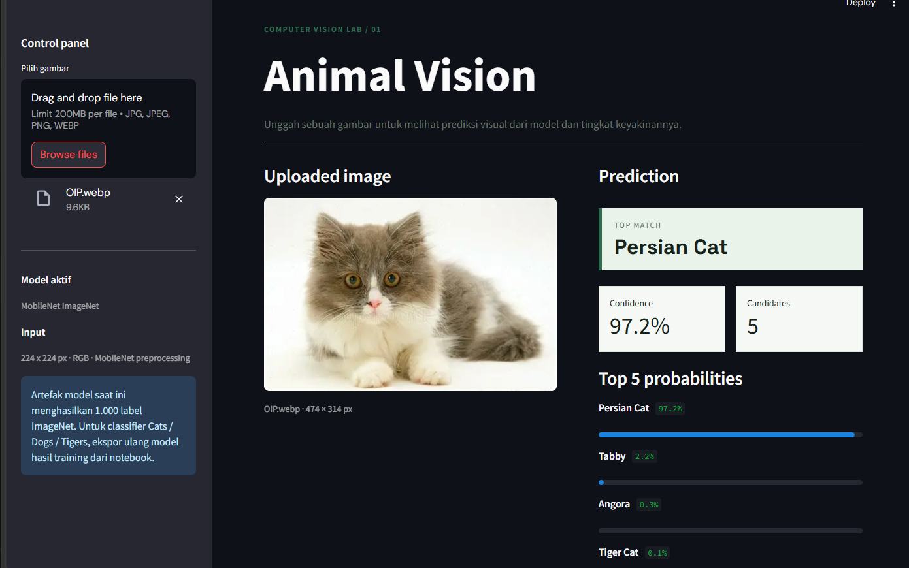

# 🐾 Proyek Klasifikasi Gambar: Hewan

Notebook ini adalah bagian dari proyek klasifikasi gambar menggunakan deep learning untuk mengenali jenis hewan dari gambar. Model yang digunakan berbasis Convolutional Neural Network (CNN) dan dilatih menggunakan dataset dari Kaggle.

## 👤 Informasi Peserta

* **Nama:** Desti Nur Irawati
* **Email:** [11221033@student.itk.ac.id]
* **ID Dicoding:** desssti06

## 📁 Deskripsi Proyek

Proyek ini bertujuan untuk membangun sistem klasifikasi otomatis yang mampu mengenali berbagai jenis **hewan** dari citra gambar menggunakan teknik deep learning. Dataset diperoleh dari Kaggle (`nicopalv/dataset-klasifikasi-gambar-hewan`) dan diproses menggunakan TensorFlow dan Keras.

📦 Dataset
Jumlah kelas: 3

Kelas hewan:
🐯 Tigers
🐶 Dogs
🐱 Cats

Sumber:  https://www.kaggle.com/datasets/nicopalv/dataset-klasifikasi-gambar-hewan

## 🛠️ Teknologi dan Library

* Python 3.x
* TensorFlow & Keras
* Pandas, NumPy
* Matplotlib
* scikit-learn
* PIL (Python Imaging Library)
* `kagglehub` (untuk mengunduh dataset)

## 📂 Struktur Notebook

1. **Instalasi dan Import Library**
   Menginstal serta mengimpor pustaka yang diperlukan seperti TensorFlow, Matplotlib, Keras, dll.

2. **Pengunduhan Dataset**
   Menggunakan `kagglehub` untuk mengunduh dataset klasifikasi gambar hewan.

3. **Persiapan Data**

   * Augmentasi dan preprocessing data dengan `ImageDataGenerator`.
   * Membagi dataset menjadi data latih (training) dan validasi.

4. **Pembuatan Model CNN**

   * Arsitektur terdiri dari beberapa lapisan Conv2D, MaxPooling, Dropout, dan Dense.
   * Menggunakan optimizer Adam dan regularisasi L2.

5. **Pelatihan Model**

   * Melatih model selama beberapa epoch.
   * Menggunakan callback `EarlyStopping` untuk mencegah overfitting.

6. **Evaluasi dan Visualisasi**

   * Visualisasi akurasi dan loss.
   * Menampilkan confusion matrix untuk mengevaluasi performa model.

## 🚀 Cara Menjalankan

1. Jalankan di Jupyter Notebook atau Google Colab.
2. Pastikan library telah terinstal
3. Jalankan setiap cell dari atas ke bawah.

### Dashboard Streamlit

Jalankan dari folder utama proyek:

```bash
streamlit run app.py
```

Dashboard membaca model dari `saved_model/1`. Model yang saat ini tersimpan adalah
MobileNet pretrained dengan 1.000 label ImageNet. Agar dashboard menghasilkan tiga
kelas `Tigers`, `Dogs`, dan `Cats`, simpan model klasifikasi hasil training sebelum
menjalankan ekspor SavedModel.


## 📊 Output

* Model CNN untuk klasifikasi gambar hewan.
* Grafik akurasi dan loss.
* Confusion matrix untuk evaluasi klasifikasi.

## 📄 Lisensi

Dataset digunakan dari [Kaggle](https://www.kaggle.com/datasets/nicopalv/dataset-klasifikasi-gambar-hewan). Proyek ini dibuat sebagai bagian dari pembelajaran dan pengembangan model klasifikasi gambar.
